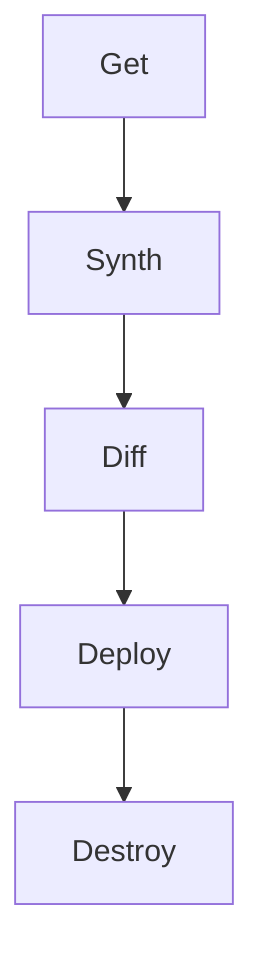

# cdktf-for-tf-engineers

An example of migrating a terraform deployment into cdktf.

# Requirements

To use this project, you need to have the following requirements met:

1. **mise**: Ensure you have [mise](https://mise.jdx.dev/) activated in your terminal. Mise is a tool that helps manage your development environment on a per-folder basis. This is incredibly useful for polyglot coding and tends to be less overhead than devcontainers. It does not replace virtual environments but can augment your use of them. It also replaces direnv for automatic loading of variables and secrets and can install packages from a number of backends.

2. Docker/containerd

3. Linux/osx

**NOTE** Make sure to have mise activated before running the script to avoid any issues.

# Using

**configure.sh**: Run the `configure.sh` script to set up your environment. This script will configure necessary dependencies and settings for the project.

```sh
./configure.sh
# Use this for further tasks if not already in your profile
eval "$(mise activate bash)"
```

Run `task` at any time to see a list of additional tasks. For this example most tasks are at the root `Taskfile.yml` manifest.

To deploy run `task deploy:all`

To destroy run `task destroy`

## About

Terraform is in the main branch

cdktf is in the cdktf branch

> **NOTE** In either branch run `task deploy:all` to run a multiple part terraform deployment using modules and multiple state files.

# Tips

- This builds a kube cluster then drops a private key and the kube config file locally in an ignored `./secrets` path. You can use this to your advantage and target that folder with sops to encrypt things per cluster with just a wee bit more work ;)

- You can use [OpenLens](https://github.com/MuhammedKalkan/OpenLens) to explore your local cluster by pointing it at the kube config file.

- Most everything can be configured in the `Taskfile.yml` file, including if you'd like to use tofu or terraform. Fun for testing some of the new tofu features out.

- If `task deploy:all` fails try `task deploy`. If that fails try removing the cluster `kind delete cluster -n cluster1`

# Migration

First setup node to then use it to get the base cdktf packages.

```sh
eval "$(mise activate bash)" # If not already in PATH

# Need an older version of NodeJS per https://github.com/hashicorp/terraform-cdk/issues/3641
mise use node@20

# install the cli globally to run it outside of the project itself
npm install -g cdktf-cli@latest

# create a new empty project folder
#  then start a new cdktf project there based on our terraform project
mkdir -p ./infrastructure/environments/local-cdktf
pushd ./infrastructure/environments/local-cdktf
cdktf init \
  --template=typecript \
  --project-name local-cdktf \
  --local \
  --from-terraform-project ./infrastructure/environments/local
popd
```

At this point I ran into some conversion issues. It duplicated some imports into the resulting `main.ts` file that needed to be removed. Also had to add the `App` import from cdktf.

Additionally, the generated `package.json` file did not include a deploy or destroy task so I added them.

> **TIP 1** You can use `npx` to run npm in the context of your project's `package.json` file to run project local cached binaries.

> **TIP 2** Any of the `scripts` section of package.json can be run in a similar manner as a makefile or taskfile as well (ie. `npm run get`)

At this point you will need to pull down any terraform providers and modules being used. These are defined in the project local `cdktf.json` manifest. You can add or remove providers using the cdktf cli `cdktf provider add hashicorp/helm` for instance.

The order of operations to ensure you get everything you need to synthesize the terraform and run through a full deploy is as follows:



| Action        | Is Like           | Description                                                            |
| ------------- | ----------------- | ---------------------------------------------------------------------- |
| `cdk get`     | `terraform init`  | Generate bindings for providers and modules in the `./.gen` folder     |
| `cdk synth`   | NA                | Generate the final terraform that will be processed (defaults to json) |
| `cdk diff`    | `terraform plan`  | Optionally generate a difference plan                                  |
| `cdk deploy`  | Terraform apply   | Deploy it                                                              |
| `cdk destroy` | terraform destroy | Blow it all away                                                       |

You can view what terraform actually gets generated in HCL as well using `cdk synth --hcl`. All synthesized code ends up in the local `cdktf.out` folder.

> **WARNING** If you synth the hcl manifests ensure you delete them from cdktf.out when done. Otherwise when synth runs your terraform will be duplicated in both hcl and json and fail!

If you are up for it you can run through the full deploy and destroy lifecycle at this point.

```bash
pushd infrastructure/environments/local-cdktf
npm run get
npm run synth
npm run deploy
popd
```

If you got this far good. You also may have noticed that there are not 1 but two entrypoints for my terraform. I've got the clusters being created then afterwards we process each target environment cluster's initial argocd deployment and per-cluster ssh key generation.

If you look at the cdktf documentation there is the notion of a 'stack' that is inherited from cloudformation-land. These run individually either sequentially or in parallel (default). Lets see if we can turn `infrastructure/environments/local/cluster1` into its own stack within the existing `local-cdktf` we just created.

To do this we need to define the conversion as a stack and manually ensure the various providers it uses are listed.

```bash
# This is what I started with, don't run this and overwrite unless you want to start from scratch!
pushd infrastructure/environments/local-cdktf
../../../scripts/merge-convert.sh ../local/cluster1 | cdktf convert --language typescript --stack --provider hashicorp/kubernetes --provider hashicorp/helm > clusterconfig.ts
cdktf provider add hashicorp/kubernetes
cdktf provider add hashicorp/helm
popd
```

The autogenerated `clusterconfig.ts` file will create a stack object called`MyConvertedCode` that we will change to `ClusterConfig`. We also need to add in referenced terraform modules to `cdktf.json`. It should look like this when done:

```json
{
  "language": "typescript",
  "app": "npx ts-node main.ts",
  "projectId": "b0d8b84d-514e-4b09-8e5b-b837ac428411",
  "sendCrashReports": "false",
  "terraformProviders": [
    "hashicorp/kubernetes",
    "hashicorp/helm",
    "tehcyx/kind@0.7.0"
  ],
  "terraformModules": [
    "../../modules/k8s-kind-cluster",
    "../../modules/self-signed-cert"
  ],
  "context": {}
}
```

> **NOTE** Providers that have an official hashicorp cdktf package will end up in the `package.json` file. Anything else will land in the `cdktf.json` file to be sourced into the `.gen` folder with the get stage.

The next hang up here is if we want to use the cdktf version of the providers or use the automatically generated bindings from the terraform version of the provider. In this case both the kubernetes and helm providers have cdktf native versions. For this migration I'm simply going to keep the terraform auto-generated module bindings. If this were a big upgrade you'd have to revisit this file to use the official cdktf provider library.

Regardless, there are changes needed in the generated file. We update the class to be exported as a member and change the name to be less generic.

## Multiple Stacks

After importing the (mostly) autogenerated stack for the cluster configuration via `import { ClusterStack } from "./cluster1";` we instantiate a new instance of it in `main.ts` (after our other stack). The synth process will generate the terraform for it in its own folder as you may expect from an entirely separate terraform project pipeline.

```typescript
const app = new App();
new BootstrapStack(app, "infrastructure");
new ClusterStack(app, "cluster1");
app.synth();
```

You can synthesize the terraform now if you want to review things. Or you can just deploy all the defined stacks (use glob patterns with single quotes to do them all, `--parallelism=1` to ensure they run sequentially).

```bash
pushd infrastructure/environments/local-cdktf
npm install
cdktf get
cdktf synth
cdktf deploy --parallelism=1 '*'
popd
```

At this point I ran into errors. Using terraform wrapped constructs such as variables doesn't support certain interpolation formats in strings and otherwise is just a pain to deal with. So I removed them entirely from the both stacks in favor of sending along a list of properties.

Also, the multiple stack synth happens via a common entrypoint (`main.ts`) so I made a config.json file that I then dumped all the collective `.tfvar` data into. This then gets sources in for use in all the stacks. I'm using a bunch of relative paths for state, keys, and kube config files to float them to the root of the project in one location. (This feels wrong so it probably is, production stuff like this would go right into a vault or secrets management solution).

```json
{
  "env": "local",
  "argocd_namespace": "argocd",
  "argocd_version": "stable",
  "infrastructure": {
    "state": "../../../../../../secrets/local/infra_state"
  },
  "cluster1": {
    "state": "../../../../../../secrets/local/cluster1_state",
    "kubeconfig": "../../../../../../secrets/local/cluster1_config",
    "helm_values": "./cluster1/config.yml",
    "secrets_path": "../../../../../../secrets/local"
  }
}
```

This then should allow you to run through a full multi-stack deployment locally to create the start of your argocd kube cluster deployment locally. The generated ssh keys and cluster config will be in `./secrets/local`

Test out kubernetes has the argocd deployments running:

```bash
export KUBECONFIG=./secrets/local/cluster1_config
kubectl get deployments.apps --all-namespace
```

If you are all done blow it all away with `cdktf destroy '*'`.

# Conclusion

There are a ton of improvements that can be made to this but the gist of the flow to go from terraform to cdktf should be here. I chose TypeScript but you can go with a number of languages.

I'm uncertain that I'd be interested in combining the cdks for various technologies because they'd all need to be processed independently and don't really synthesize to the same code anyway. If you were using cdktf to do Kuberentes updates there'd be little reason I could see to additionally produce a cdk8s additional deployment processes for instance.

I do like that more fully realized variable handling and logic can be done using CDKTF. Just keep in mind that you cannot break the rules of terraform itself.

For more information on CDKTF and all of its features hit up [the official site](https://developer.hashicorp.com/terraform/cdktf) for it.
